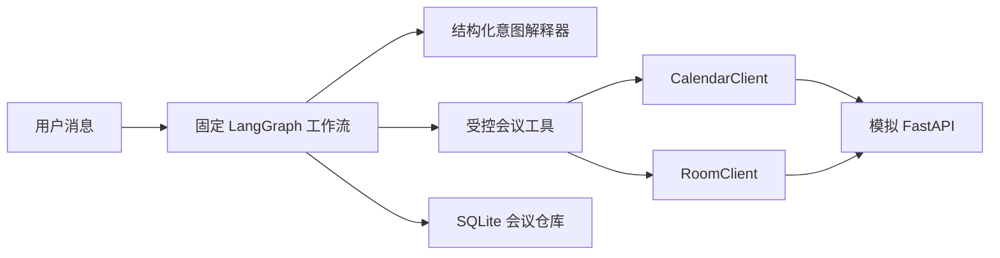

# 智能会议助手补全设计

## 目标

在保持现有安全边界和确定性演示能力的前提下，补齐题目要求但当前尚未完整实现的能力：

- 用户可直接查询一名或多名参会人的空闲时间；
- Agent 通过模拟 HTTP API 查询日历和会议室；
- 多个会议时可按序号、主题或会议 ID 继续选择和修改；
- “把时间改到下午 3 点”保留原会议日期；
- 忙闲冲突返回明确的业务提示；
- wheel 包含运行所需的 SQLite schema；
- 仓库约定文档统一使用简体中文。

不新增删除会议、周期会议、真实日历 OAuth、多 Agent、RAG 或外部部署能力。

## 总体架构

保留现有 FastAPI、LangGraph、SQLite 和端口适配器结构。模型或确定性解释器仍然只能生成结构化命令，不能直接访问数据库、身份信息或任意网络。

模拟集成能力由独立的 FastAPI 应用提供。运行时使用 `httpx.AsyncClient` 和 `ASGITransport` 发出真实 HTTP 请求，因此 Agent 会经过请求序列化、HTTP 路由、响应校验和错误转换，同时不需要额外启动进程。主应用继续公开 `/mock/calendar/freebusy` 和 `/mock/rooms/search`，便于演示和人工验证；两个入口复用同一组模拟数据与响应模型。

## 空闲时间查询

`MeetingCommand.operation` 新增 `availability`，并携带独立的空闲查询对象：参会人 ID、查询窗口和期望会议时长。解释器不得把这些字段混入会议草稿。

- “查询 Bob 明天下午 3 点是否空闲”：查询 15:00 至 16:00，返回该时间段是否全部空闲；
- “Bob、Carol 明天下午什么时候都有空”：查询 13:00 至 18:00，并用 `find_common_free_slots` 计算共同空闲区间；
- 缺少参会人、日期或时间窗口时进入 `needs_clarification`，不得猜测身份或整天范围；
- 回复只包含用户请求的参会人及忙闲区间，不暴露会议标题。

演示解释器支持题目和 README 中的固定中文话术；LLM 解释器通过结构化输出生成相同命令。所有查询仍由服务端校验时间窗口和参会人列表。

## 多轮会议选择与改期

查询会议时按顺序返回带序号的列表，并把可见会议的 ID、主题、开始时间、结束时间保存到会话状态。只有服务端查询到的可见会议才能成为候选项。

当更新请求无法唯一确定会议时，状态保留更新草稿和候选列表，并要求用户选择。后续支持：

- “第一个”“第二个”等序号；
- 完整会议 ID；
- 能唯一匹配的会议主题。

选择成功后继续之前的更新草稿并生成预览；无匹配或多重匹配时继续澄清。参会者可查询可见会议，但只有组织者能执行更新。

对于仅提供时间而未提供日期的更新，解释器以已选会议的日期作为基准。明确出现“今天”或“明天”时才使用相对当前时间计算日期。LLM 解释器的上下文包含当前选中会议和候选会议摘要，使其遵守相同语义。

## 错误处理与安全

新增可识别的参会人忙碌业务错误，包含忙碌参会人 ID，但不包含私人会议标题。服务层将其转换为明确回复，例如“参会人 carol 在该时间段忙碌，请调整时间”。

HTTP 超时、非成功状态码、响应结构错误仍统一转换为集成错误，并回复“会议服务暂时不可用”。危险请求预检、无删除工具、显式确认、确认哈希、权限检查、参数化 SQL、幂等键和乐观锁保持不变。

## 打包与生命周期

`pyproject.toml` 将 `app/repositories/schema.sql` 加入包数据，并把 `build` 加入开发依赖。构建验收必须从 wheel 安装到隔离目录，再从仓库外工作目录初始化 `MeetingRepository`，避免源码目录掩盖漏包问题。

运行时负责关闭持有的 `httpx.AsyncClient`。FastAPI lifespan 在应用关闭时调用运行时清理方法；测试中注入的自定义运行时也遵循同一接口。

## 测试策略

所有行为变更按测试驱动方式完成：先增加失败测试并确认失败原因，再写最小实现。

1. 单元测试：空闲查询解析、无日期改期、序号和主题选择、共同空闲区间。
2. 集成测试：Agent 经过 HTTP client 调用模拟 API；忙碌提示明确；多个会议经过澄清后完成修改。
3. 端到端测试：题目原话“把时间改到下午 3 点”和“查询 bob 明天下午 3 点是否空闲”。
4. 打包测试：构建 wheel、检查 `schema.sql`、隔离安装后初始化数据库。
5. 全量门禁：pytest 覆盖率、Ruff 检查、Ruff 格式、compileall、pip check、build 和 wheel 安装验证。

## 文档范围

以下内容统一为简体中文：

- `README.md`；
- `DESIGN.md`；
- `docs/**/*.md`；
- `.env.example` 注释。

代码标识符、环境变量名、命令、路径、HTTP 路径、JSON 字段和第三方产品名保持英文，以保证可复制性和接口兼容性。
